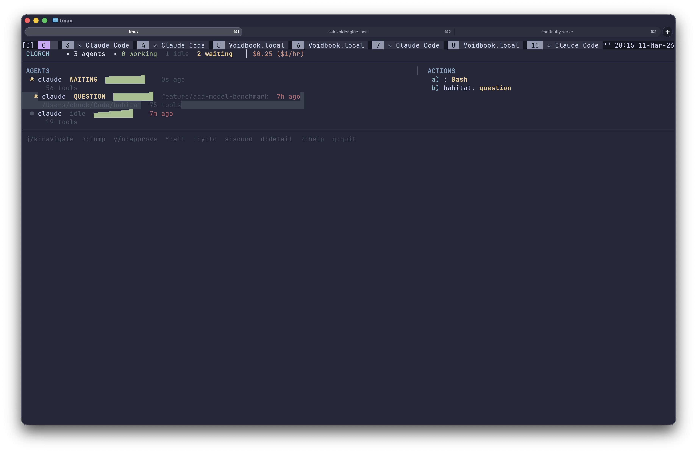

# clorch

**Command center for your Claude Code fleet.**

You're running 8 agents across tmux. Three are blocked on permissions. One is asking a question. Two compacted 10 minutes ago and you didn't notice. You've burned $47 today and the rate is climbing.

Alt-tab. Scroll. Alt-tab. Scroll. Alt-tab. Approve. Wrong pane. Alt-tab.

clorch fixes this. One dashboard. Every agent. Every permission. Every dollar.



## Install

```sh
go install github.com/lazypower/clorch/cmd/clorch@latest
```

Or build from source:

```sh
git clone https://github.com/lazypower/clorch
cd clorch
make build    # → bin/clorch
```

## Setup

```sh
clorch init
```

That's it. This installs async hooks into `~/.claude/settings.json` and drops two bash scripts into `~/.local/share/clorch/hooks/`. Your existing hooks are preserved — clorch merges non-destructively and backs up your settings first.

Start your agents however you normally do. tmux, iTerm tabs, whatever. clorch discovers them automatically through hook events.

```sh
clorch            # launch the dashboard
```

## How It Works

```
Claude Code  ──hook events──▶  bash scripts  ──atomic JSON write──▶  /tmp/clorch/state/
                                                                           │
clorch TUI  ◀──fsnotify────────────────────────────────────────────────────┘
```

No API calls. No terminal scraping. No process injection. Claude Code's native hook system fires events, two bash scripts write JSON state files, and clorch watches the directory. Sub-100ms updates on both macOS and Linux.

## Keybindings

| Key | Action |
|-----|--------|
| `j` / `k` | Navigate agent list |
| `Enter` / `→` | Jump to agent's tmux pane |
| `a`–`z` | Focus action item |
| `y` / `n` | Approve / deny focused permission |
| `Y` | Approve all pending permissions |
| `!` | Toggle YOLO mode |
| `s` | Toggle sound notifications |
| `d` | Agent detail panel |
| `?` | Help |
| `q` | Quit |

## Rules Engine

`~/.config/clorch/rules.yaml`:

```yaml
yolo: false

rules:
  # Always approve read-only tools
  - tools: [Read, Glob, Grep]
    action: approve

  # Never auto-approve destructive commands
  - tools: [Bash]
    pattern: "rm -rf"
    action: deny

  - tools: [Bash]
    pattern: "git push --force"
    action: deny

  # Auto-approve edits
  - tools: [Edit, Write]
    action: approve
```

First match wins. Deny rules always require manual review, even in YOLO mode.

## CLI

```sh
clorch                  # TUI dashboard (default)
clorch init             # install hooks
clorch init --dry-run   # preview hook changes
clorch uninstall        # remove hooks
clorch status           # "3 working, 1 waiting" (for scripting)
clorch list             # non-interactive agent table
clorch tmux-widget      # status-right output with Nord colors
clorch version          # print version
```

## tmux Status Bar

Add to your `~/.tmux.conf`:

```
set -g status-right '#(clorch tmux-widget)'
```

Gives you:

```
●3 ◉1 ✕0
```

Three working, one waiting, zero errors. Nord palette colors.

## Notifications

When an agent needs attention, clorch fires:

- **Terminal bell** — works everywhere
- **macOS notification** — native `osascript` banner
- **System sound** — Sosumi for permissions, Ping for questions, Basso for errors

Notifications only fire on state *transitions*, not repeated polls. Toggle sound with `s` in the TUI.

## Usage Tracking

clorch parses Claude Code's JSONL session transcripts and shows:

- Total cost for today's sessions
- Rolling 10-minute burn rate ($/hour)
- Per-model token breakdowns

Displayed in the TUI header. No API keys needed — it reads the local transcript files directly.

## Environment Variables

| Variable | Default | Purpose |
|----------|---------|---------|
| `CLORCH_STATE_DIR` | `/tmp/clorch/state` | State file directory |
| `CLORCH_SESSION` | `claude` | tmux session name |
| `CLORCH_TERMINAL` | auto-detect | Force terminal backend |
| `CLORCH_POLL_MS` | `500` | Polling fallback interval |
| `CLORCH_RULES` | `~/.config/clorch/rules.yaml` | Rules file path |

## Requirements

- Go 1.21+
- `jq` (used by hook scripts)
- tmux (for approve/deny and pane navigation)
- macOS or Linux

## Prior Art

Rewrite of [androsovm/clorch](https://github.com/androsovm/clorch) (Python/Textual). Same state protocol, same hook scripts, same rules format. Drop-in replacement — no hook reinstall needed if you're migrating.

## License

MIT
